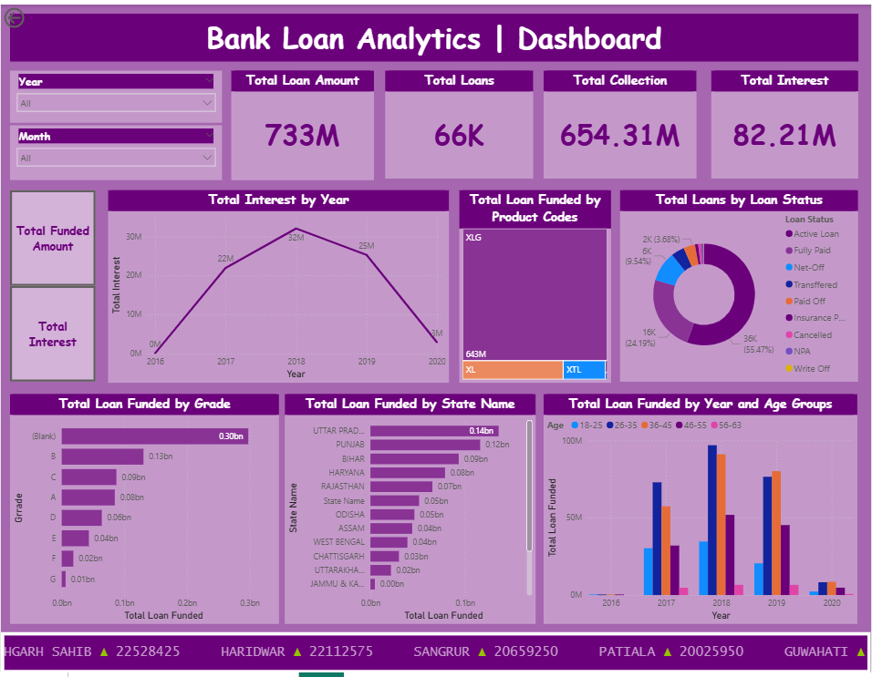

# bank-loan-analysis
# 🏦 Bank Loan Analytics Dashboard
**(Excel | SQL | Power BI)**

## 📌 Project Overview

This project presents an **end-to-end Bank Loan Data Analytics Dashboard** designed to analyze **loan disbursement, repayment behavior, portfolio quality, and risk indicators** using **Excel, SQL, and Power BI**.

The dashboard enables banks and financial stakeholders to **monitor loan performance, identify default and delinquency risks, track collections, and analyze trends across time, geography, and customer segments**.

The solution is built from a **Data Analyst perspective**, focusing on **decision-making insights rather than just visual design**.

---

## 🛠 Tools & Technologies Used

* **Microsoft Excel**

  * Data cleaning & preprocessing
  * Pivot Tables & Pivot Charts
  * KPI calculations

* **SQL**

  * Data extraction & transformation
  * Joins, aggregations, filtering
  * Business-driven analytical queries

* **Power BI**

  * Interactive dashboards & KPIs
  * DAX measures
  * Drill-down & slicers

---

## 📂 Dataset Description

The dataset contains **loan-level banking data**, including:

* Loan ID & Account details
* Loan amount & funded amount
* Interest amount
* Collection amount
* Loan status (Active, Fully Paid, NPA, Default, etc.)
* Product codes
* Credit grades
* Loan maturity period
* State & branch details
* Disbursement date

---

## 🧹 Data Cleaning & Transformation

Data preparation was performed using **Excel & SQL** to ensure accuracy and consistency.

### 1️⃣ Duplicate & Missing Value Handling

* Removed duplicate loan records
* Handled missing values in grade, maturity, and state fields

### 2️⃣ Column Standardization

* Renamed columns for **business readability**
* Standardized categorical values (Loan Status, Product Codes, Grades)

### 3️⃣ Date & Time Processing

* Converted disbursement dates to proper date format
* Created **Year and Month columns** for trend analysis

### 4️⃣ Calculated Fields

* Interest collected
* Default loan rate
* Delinquent loan rate
* Verified vs Non-verified loans

---

## 🧱 Data Modeling

* Structured fact and dimension tables

* Created relationships between:

  * Loan data
  * Date
  * State
  * Product & Grade

* Built optimized DAX measures for KPIs

---

## 📊 Key KPIs

The dashboard tracks the following business-critical metrics:

* **Total Loans Issued**
* **Total Loan Amount**
* **Total Interest Earned**
* **Total Collection Amount**
* **Default Loan Rate**
* **Delinquent Loan Rate**
* **Unverified Loans Percentage**

---

## 📈 Visualizations & Analysis

The dashboard includes:

* 📉 **Loan Disbursement Trend (Monthly / Yearly)**
* 🗺 **State-wise Loan Distribution**
* 🏷 **Loan Status Breakdown** (Active, Paid, NPA, Default)
* 🧾 **Product-wise Loan Funding**
* 🏦 **Branch-wise Loan Performance**
* 🎓 **Grade-wise Loan Distribution**
* ⏳ **Maturity-wise Loan Analysis**

---

## 🎛 Interactive Features

* Dynamic slicers for:

  * Year
  * Month
  * State
  * Product
  * Loan Status

* Drill-down enabled across charts

* KPIs update automatically based on filters

---

## 💡 Business Insights & Recommendations

### 1️⃣ Loan Portfolio Health

A significant portion of loans falls under **longer maturity periods**, contributing to higher interest earnings but increased risk exposure.

**Recommendation:**
Balance long-term loans with shorter maturity products to reduce portfolio risk.

---

### 2️⃣ Default & Delinquency Risk

Certain **credit grades and regions** show higher default and delinquency rates.

**Recommendation:**
Strengthen credit assessment and monitoring for high-risk segments.

---

### 3️⃣ Product Performance

A small number of products contribute to the **majority of loan disbursements**.

**Recommendation:**
Focus marketing and optimization strategies on top-performing loan products.

---

### 4️⃣ Geographic Concentration

Loan funding is concentrated in a few states and branches.

**Recommendation:**
Diversify lending across regions to minimize concentration risk.

---

## 🧠 Overall Strategic Insight

This analysis demonstrates how **structured data analytics can help financial institutions**:

* Improve loan portfolio monitoring
* Detect early risk signals
* Optimize lending strategies
* Support data-driven decision-making

The dashboard provides a **single source of truth** for loan performance and risk evaluation.

---

## 📸 Dashboard Preview

### 🔹 Power BI Dashboard

**

### 🔹 Excel Dashboard

**

---

## 📁 Project Files

📂 **Dashboard Files & SQL Scripts:**
*https://drive.google.com/drive/folders/1B3nA9ib_yVbSkk26YBR3iA0va4wPCmJe?usp=drive_link*

---

## 👤 Author

**Apeksha Sonawane**
Aspiring Data Analyst | Business Analytics | SQL | Power BI | Excel

⭐ *If you find this project useful, please consider starring the repository — it helps recruiters discover my work!*

---

Just say the word 💙
